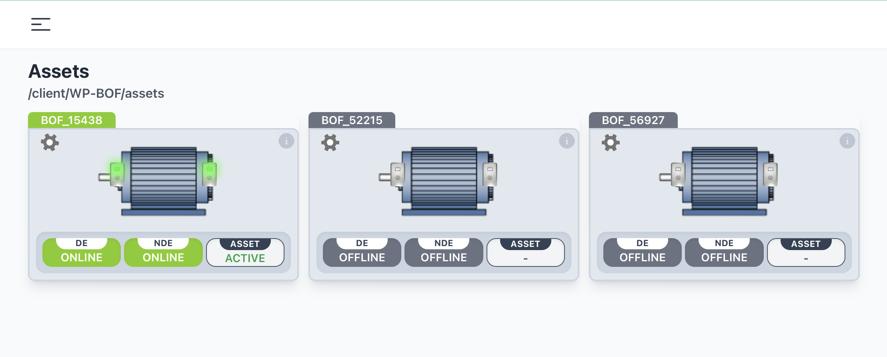
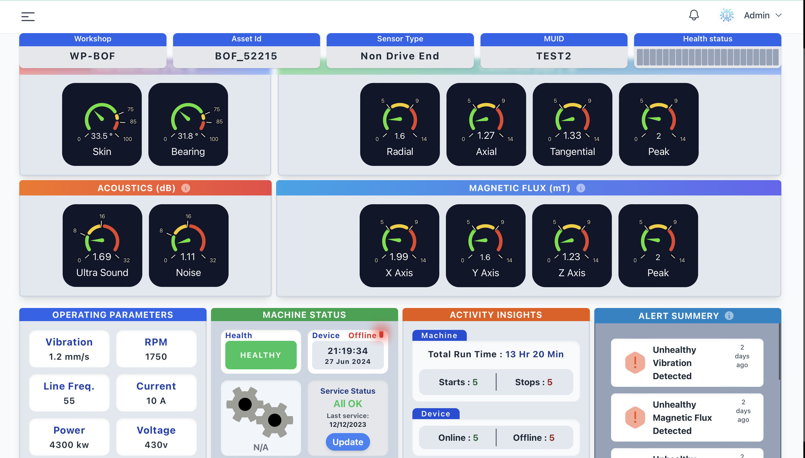
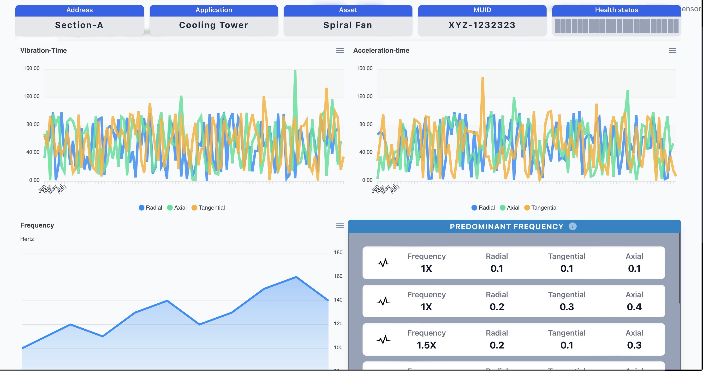

# Equipment Health Monitoring

[](LICENSE)

 </img>

## Table of Contents
- [Overview](#overview)
- [Features](#features)
- [Technologies Used](#technologies-used)
- [Installation](#installation)
- [Usage](#usage)
- [Screenshots](#screenshots)
- [Contributing](#contributing)
- [License](#license)
- [Contact](#contact)

## Overview
The Equipment Health Monitoring project aims to provide a comprehensive solution for monitoring and assessing the health of various equipment in real-time. By leveraging sensor data and advanced algorithms, the system can predict potential failures and maintenance needs, thereby minimizing downtime and improving operational efficiency.


## Features
- Real-time monitoring of equipment health
- Predictive maintenance alerts
- Detailed analytics and reporting
- User-friendly interface
- Scalable and customizable architecture


## Technologies Used
- **Hardware:** Node Red, Mosquitto, MQTT, ESP-IDF, Sensors, Open Source MicroControllers
- **Backend:** Python, Flask, Express JS, Node JS
- **Frontend:** HTML, CSS, JavaScript, React JS
- **Database:** SQLite
- **Others:** Pandas, NumPy, Matplotlib

## Installation
To get a local copy up and running, follow these steps:

1. **Clone the repository:**
    ```sh
    git clone https://github.com/RiteshhGitH/Equipment-Health-Monitoring.git
    ```
2. **Navigate to the project directory:**
    ```sh
    cd Equipment-Health-Monitoring
    ```
3. **Create a virtual environment:**
    ```sh
    python -m venv env
    ```
4. **Activate the virtual environment:**
    - On Windows:
        ```sh
        .\env\Scripts\activate
        ```
    - On macOS/Linux:
        ```sh
        source env/bin/activate
        ```
5. **Install the required dependencies:**
    ```sh
    pip install -r requirements.txt
    ```

## Usage
1. **Run the application:**
    ```sh
    python app.py
    ```
2. Open your web browser and go to `http://localhost:5000` to access the application.

## Screenshots
Here are some screenshots of the application:

*List of some assets connected real-time*


*Dashboard view showing real-time equipment health status.*


*Analytics view providing detailed reports and insights.*

## Contributing
Contributions are welcome! Please follow these steps to contribute:

1. Fork the repository.
2. Create a new branch: `git checkout -b feature/YourFeatureName`
3. Commit your changes: `git commit -m 'Add some feature'`
4. Push to the branch: `git push origin feature/YourFeatureName`
5. Open a pull request.

## License
This project is licensed under the MIT License. See the [LICENSE](LICENSE) file for more details.

## Contact
**Ritesh Nandy**
- GitHub: [RiteshhGitH](https://github.com/RiteshhGitH)
- Email: [ritesh.nandyofficial@gmail.com](mailto:ritesh.nandyofficial@gmail.com)
